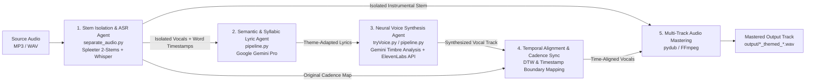

# LyricForge

**Multi-Agent AI Audio Transformation & Vocal Synthesis Pipeline**  
*Built at HackNotts 2025 (University of Nottingham)*

[](https://www.python.org/)
[](https://ai.google.dev/)
[](https://elevenlabs.io/)
[](https://github.com/openai/whisper)
[](https://github.com/deezer/spleeter)

**LyricForge** is an end-to-end multi-agent audio engineering and generative AI pipeline that decomposes full-mix songs into isolated stems, extracts word-level timestamped transcriptions, rewrites lyrics around arbitrary semantic themes with syllabic and cadence constraints, synthesizes neural vocals matched to target artist timbres, and masters the transformed vocal track back over the original instrumental accompaniment.

---

## System Architecture



### 5-Stage Multi-Agent Pipeline

1. **Stem Isolation & ASR Agent (`separate_audio.py`, `PreProcessAgent`)**
   - Decomposes stereo source audio into isolated vocal (`vocals.wav`) and accompaniment (`accompaniment.wav`) stems using Deezer's pretrained 2-stem U-Net source separation model (**Spleeter**).
   - Runs automatic speech recognition (ASR) on the isolated vocal stem via **OpenAI Whisper** (`word_timestamps=True`), extracting segment- and word-level temporal boundaries alongside language metadata.

2. **Semantic & Syllabic Lyric Agent (`pipeline.py`, `LyricGenerationAgent`)**
   - Prompts **Google Gemini** (`gemini-pro`) to rewrite the transcribed lyrics around a user-specified thematic domain while enforcing structural invariants: line-by-line syllable count parity, prosodic rhythm, and stanza cadence so the generated lyrics fit the original vocal phrasing.

3. **Neural Voice Synthesis Agent (`tryVoice.py`, `VoiceSynthAgent`)**
   - Performs artist timbre profiling via **Google Gemini** (analyzing vocal register, tone quality, delivery dynamics, and acoustic characteristics of a target artist) and matches the profile against available **ElevenLabs** voice models.
   - Synthesizes high-fidelity neural vocal tracks (`eleven_multilingual_v2`, 44.1 kHz / 128 kbps MP3) via the **ElevenLabs TTS & Voice Cloning API**.

4. **Temporal Alignment & Cadence Synchronization (`AlignerAgent`)**
   - Aligns synthesized vocal segments against the original Whisper timestamp boundaries and cadence map using Dynamic Time Warping (`fastdtw` / `librosa`) so vocal phrasing locks onto the underlying musical meter.

5. **Multi-Track Audio Mastering (`MixerAgent`)**
   - Normalizes track durations, trims or pads stem boundaries, and overlays the aligned neural vocals onto the isolated instrumental stem via **pydub** and **FFmpeg**, exporting a mastered WAV mix (`output/<song>_themed_<theme>.wav`).

---

## Project Structure

```text
LyricForge/
├── pipeline.py          # End-to-end 5-agent orchestrator & CLI entrypoint
├── separate_audio.py    # Spleeter 2-stem separation microservice endpoint
├── tryVoice.py          # Standalone ElevenLabs neural TTS synthesis utility
├── test_api_key.py      # Environment & Gemini API connectivity diagnostics
├── requirements.txt     # Python audio DSP & generative AI dependencies
└── .env.example         # Template for required API credentials
```

---

## Getting Started

### Prerequisites

- **Python 3.8+**
- **FFmpeg** installed and available on your system `PATH` (required by `spleeter`, `whisper`, and `pydub`)
- **Google Gemini API Key** (`GEMINI_API_KEY`)
- **ElevenLabs API Key** (`ELEVENLABS_API_KEY`)

### 1. Installation

```bash
git clone https://github.com/Maseeek/LyricForge.git
cd LyricForge

python -m venv .venv
# Windows
.\.venv\Scripts\activate
# macOS / Linux
source .venv/bin/activate

pip install -r requirements.txt
```

### 2. Environment Configuration

Copy `.env.example` to `.env` and populate your API credentials:

```bash
cp .env.example .env
```

```ini
GEMINI_API_KEY=your_gemini_api_key
ELEVENLABS_API_KEY=your_elevenlabs_api_key
```

Verify your environment setup and API connectivity:

```bash
python test_api_key.py
```

---

## Usage

Run the full 5-stage transformation pipeline via `pipeline.py`:

```bash
python pipeline.py --song <path_to_audio> --theme "<target_theme>" [--artist "<artist_voice_style>"]
```

### Examples

```bash
# Rewrite a track around a space exploration theme with artist-matched vocal synthesis
python pipeline.py --song input.mp3 --theme "space exploration" --artist "Drake"

# Transform a WAV track into a medieval fantasy ballad
python pipeline.py --song my_song.wav --theme "medieval fantasy" --artist "J. Cole"
```

### CLI Arguments

| Argument | Required | Description |
| :--- | :---: | :--- |
| `--song` | Yes | Path to the source audio file (`MP3`, `WAV`, `FLAC`, etc.) |
| `--theme` | Yes | Target semantic theme for lyric generation |
| `--artist` | No | Reference artist name for Gemini vocal timbre profiling and ElevenLabs voice selection |
| `--gemini-api-key` | No | Override `GEMINI_API_KEY` environment variable |
| `--elevenlabs-api-key` | No | Override `ELEVENLABS_API_KEY` environment variable |

### Output Artifacts

All generated artifacts are written to the `output/` directory:
- `output/separated/<song_name>/vocals.wav` — Isolated vocal stem
- `output/separated/<song_name>/accompaniment.wav` — Isolated instrumental stem
- `output/new_vocals.mp3` — Synthesized ElevenLabs vocal track
- `output/<song_name>_themed_<theme>.wav` — Final mastered multi-track mix

---

## License

MIT License
